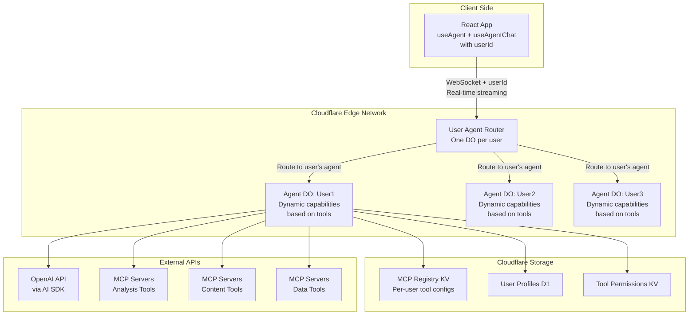

# AI Agent Architecture Design  
**Cloudflare Agent SDK + Dynamic Tool-Based Capabilities**
*One Agent Per User with Dynamic Capabilities*

## Overview

This document outlines the architecture for a scalable AI agent system where **each user gets one intelligent Agent DO** that dynamically adapts its capabilities based on available tools, built on Cloudflare's Agent SDK patterns.

Key capabilities:
- **One Agent DO per user** - complete isolation and personalization
- **Dynamic capabilities based on available tools** - agent adapts behavior contextually
- **Tool-driven intelligence** - capabilities emerge from tool availability
- Real-time WebSocket communication using Agent SDK hooks
- Integrate with multiple MCP (Model Context Protocol) servers per user
- Persistent user memory and context within each user's Agent DO
- Built-in tool system with human-in-the-loop confirmation

## System Architecture

### High-Level Components



## One Agent Per User Architecture

### 1. Frontend: Simple User-Based Connection

**Simplified frontend - one agent per user:**

```typescript
// src/app.tsx
import { useAgent } from "agents/react";
import { useAgentChat } from "agents/ai-react";

interface UserAgentProps {
  userId: string;
}

export default function UserAgent({ userId }: UserAgentProps) {
  // Connect to user's single agent
  const agent = useAgent({
    agent: userId, // One agent instance per user
  });

  const {
    messages: agentMessages,
    input: agentInput,
    handleInputChange: handleAgentInputChange,
    handleSubmit: handleAgentSubmit,
    addToolResult,
    clearHistory,
    isLoading,
    stop,
  } = useAgentChat({
    agent,
    maxSteps: 10, // Allow multi-step tool workflows
  });

  return (
    <div className="user-agent-interface">
      <div className="agent-header">
        <h2>Your AI Assistant</h2>
        <span>Intelligent agent with dynamic capabilities</span>
      </div>
      
      {agentMessages.map((message) => (
        <MessageComponent 
          key={message.id} 
          message={message}
          userId={userId}
        />
      ))}
      
      <form onSubmit={handleAgentSubmit}>
        <input 
          value={agentInput}
          onChange={handleAgentInputChange}
          placeholder="What can I help you with today?"
        />
        <button type="submit" disabled={isLoading}>
          {isLoading ? "Thinking..." : "Send"}
        </button>
      </form>
      
      {/* Dynamic capability indicator */}
      <AgentCapabilities userId={userId} />
    </div>
  );
}

// Shows what the agent can currently do based on available tools
function AgentCapabilities({ userId }: { userId: string }) {
  const [capabilities, setCapabilities] = useState<string[]>([]);
  
  useEffect(() => {
    // Fetch current capabilities from agent
    fetch(`/api/users/${userId}/capabilities`)
      .then(res => res.json())
      .then(data => setCapabilities(data.capabilities));
  }, [userId]);
  
  return (
    <div className="agent-capabilities">
      <h4>Current Capabilities:</h4>
      <div className="capability-tags">
        {capabilities.map(cap => (
          <span key={cap} className="capability-tag">{cap}</span>
        ))}
      </div>
    </div>
  );
}
```

### 2. Worker: LEXI Application Routing (SECURITY CORRECTED)

**LEXI-specific routing with secure user identification:**

```typescript
// src/server.ts - LEXI application routing (SECURE VERSION)
export default {
  async fetch(request: Request, env: Env, ctx: ExecutionContext) {
    const url = new URL(request.url);
    
    // LEXI Application Routes (SECURE):
    // GET  /lexi                        -> LEXI login/chat interface  
    // POST /lexi/auth                   -> Authenticate user
    // POST /lexi/chat                   -> Send message (authenticated)
    // GET  /lexi/capabilities           -> Get capabilities (authenticated)
    // GET  /lexi/history               -> Get history (authenticated)
    // DELETE /lexi/history             -> Clear history (authenticated)
    
    // Extract user session from secure methods
    const userSession = await extractUserSession(request, env);
    
    if (url.pathname === "/lexi/auth") {
      return handleAuthentication(request, env);
    }
    
    if (url.pathname === "/lexi" && request.method === "GET") {
      return handleLexiInterface(userSession);
    }
    
    // All other /lexi/* routes require authentication
    if (url.pathname.startsWith("/lexi/")) {
      if (!userSession?.userId) {
        return Response.json({ error: "Authentication required" }, { status: 401 });
      }
      
      return routeToUserAgent(request, env, userSession.userId);
    }
    
    // Health check
    if (url.pathname === "/health") {
      return Response.json({ 
        status: "healthy", 
        service: "LEXI",
        hasOpenAI: !!env.OPENAI_API_KEY 
      });
    }
    
    return new Response("LEXI AI Assistant", { status: 200 });
  },
} satisfies ExportedHandler<Env>;

interface UserSession {
  userId: string;        // Internal user ID (UUID)
  email: string;         // User's email (never exposed in URLs)
  sessionToken: string;  // Secure session token
  expiresAt: number;     // Session expiration
}

async function extractUserSession(request: Request, env: Env): Promise<UserSession | null> {
  // Extract session from secure cookie or Authorization header
  const sessionToken = extractSessionToken(request);
  
  if (!sessionToken) {
    return null;
  }
  
  // Validate and get session from KV (or D1)
  const sessionData = await env.USER_SESSIONS.get(`session:${sessionToken}`);
  
  if (!sessionData) {
    return null;
  }
  
  const session: UserSession = JSON.parse(sessionData);
  
  // Check expiration
  if (Date.now() > session.expiresAt) {
    await env.USER_SESSIONS.delete(`session:${sessionToken}`);
    return null;
  }
  
  return session;
}

function extractSessionToken(request: Request): string | null {
  // Try Authorization header first
  const authHeader = request.headers.get('Authorization');
  if (authHeader?.startsWith('Bearer ')) {
    return authHeader.substring(7);
  }
  
  // Try secure cookie
  const cookies = request.headers.get('Cookie');
  if (cookies) {
    const sessionMatch = cookies.match(/lexi_session=([^;]+)/);
    if (sessionMatch) {
      return sessionMatch[1];
    }
  }
  
  return null;
}

async function handleAuthentication(request: Request, env: Env): Promise<Response> {
  if (request.method !== 'POST') {
    return Response.json({ error: "Method not allowed" }, { status: 405 });
  }
  
  const { email, password, token } = await request.json();
  
  // Authenticate user (implement your auth method)
  const isValid = await validateUser(email, password, token, env);
  
  if (!isValid) {
    return Response.json({ error: "Invalid credentials" }, { status: 401 });
  }
  
  // Get or create internal user ID
  const userId = await getOrCreateUserId(email, env);
  
  // Create secure session
  const sessionToken = crypto.randomUUID();
  const session: UserSession = {
    userId,
    email,
    sessionToken,
    expiresAt: Date.now() + (24 * 60 * 60 * 1000), // 24 hours
  };
  
  // Store session in KV
  await env.USER_SESSIONS.put(
    `session:${sessionToken}`,
    JSON.stringify(session),
    { expirationTtl: 24 * 60 * 60 } // 24 hours
  );
  
  // Return session token as secure cookie
  return new Response(JSON.stringify({ 
    success: true,
    user: { id: userId, email } 
  }), {
    headers: {
      'Content-Type': 'application/json',
      'Set-Cookie': `lexi_session=${sessionToken}; HttpOnly; Secure; SameSite=Strict; Max-Age=86400; Path=/lexi`
    }
  });
}

async function getOrCreateUserId(email: string, env: Env): Promise<string> {
  // Check if user exists
  const existingUser = await env.USER_PROFILES.prepare(
    'SELECT user_id FROM user_profiles WHERE email = ?'
  ).bind(email).first();
  
  if (existingUser) {
    return existingUser.user_id as string;
  }
  
  // Create new user with UUID
  const userId = crypto.randomUUID();
  
  await env.USER_PROFILES.prepare(
    'INSERT INTO user_profiles (user_id, email, created_at) VALUES (?, ?, ?)'
  ).bind(userId, email, new Date().toISOString()).run();
  
  return userId;
}

async function validateUser(
  email: string, 
  password: string, 
  token: string, 
  env: Env
): Promise<boolean> {
  // Implement your authentication method:
  // - Email/password verification
  // - OAuth token validation  
  // - Magic link verification
  // - SSO integration
  
  // Example: Magic link token validation
  if (token) {
    const tokenData = await env.AUTH_TOKENS.get(`magic:${token}`);
    if (tokenData) {
      const data = JSON.parse(tokenData);
      await env.AUTH_TOKENS.delete(`magic:${token}`); // One-time use
      return data.email === email;
    }
  }
  
  // Example: Simple password check (use proper hashing in production)
  if (email && password) {
    const user = await env.USER_PROFILES.prepare(
      'SELECT password_hash FROM user_profiles WHERE email = ?'
    ).bind(email).first();
    
    if (user) {
      return await verifyPassword(password, user.password_hash as string);
    }
  }
  
  return false;
}

async function routeToUserAgent(
  request: Request, 
  env: Env, 
  userId: string
): Promise<Response> {
  // Use internal userId (UUID) as Agent DO key - NEVER the email
  const agentId = env.USER_AGENTS.idFromName(userId);
  const agentStub = env.USER_AGENTS.get(agentId);
  
  // Forward request to user's agent with secure session context
  return agentStub.fetch(request);
}

function handleLexiInterface(userSession: UserSession | null): Response {
  const isAuthenticated = !!userSession;
  
  return new Response(`
    <!DOCTYPE html>
    <html>
    <head>
      <title>LEXI AI Assistant</title>
    </head>
    <body>
      <div id="lexi-app" data-authenticated="${isAuthenticated}">
        ${isAuthenticated 
          ? `<div>Welcome back! Loading LEXI...</div>`
          : `<div>Please authenticate to access LEXI</div>`
        }
      </div>
      <script>
        // React app will handle authentication state
        window.LEXI_AUTH = ${JSON.stringify({ authenticated: isAuthenticated })};
      </script>
    </body>
    </html>
  `, {
    headers: { 'Content-Type': 'text/html' }
  });
}
```

### 3. Agent Implementation: Dynamic Tool-Based Capabilities

**Single agent that adapts based on available tools:**

```typescript
// src/agents/user-agent.ts
export class UserAgent extends AIChatAgent<Env> {
  private userId: string = '';
  private userProfile: UserProfile = {};
  private availableTools: any = {};
  private currentCapabilities: string[] = [];
  private mcpConnections: any[] = [];
  
  async onChatMessage(
    onFinish: StreamTextOnFinishCallback,
    options?: { abortSignal?: AbortSignal }
  ) {
    // Load user's MCP connections based on permissions
    await this.loadUserMCPServers();
    
    // Collect all tools, including MCP tools (agents-starter pattern)
    const allTools = {
      ...this.getBasicTools(),
      ...this.getPremiumTools(),
      ...this.mcp.unstable_getAITools(), // MCP tools automatically included
    };

    const dataStreamResponse = createDataStreamResponse({
      execute: async (dataStream) => {
        const processedMessages = await processToolCalls({
          messages: this.messages,
          dataStream,
          tools: allTools,
          executions: this.getToolExecutions(),
        });

        const result = streamText({
          model: openai("gpt-4o-2024-11-20"),
          system: this.buildLexiSystemPrompt(),
          messages: processedMessages,
          tools: allTools,
          onFinish: async (args) => {
            await this.updateUserMemory(args);
            // Cleanup MCP connections
            await this.cleanupMCPConnections();
            onFinish(args);
          },
          maxSteps: 10,
        });

        result.mergeIntoDataStream(dataStream);
      },
    });

    return dataStreamResponse;
  }

  private async loadUserMCPServers() {
    // Load user's MCP server permissions from database
    const mcpConfig = await this.env.USER_PROFILES.prepare(
      'SELECT mcp_servers FROM user_profiles WHERE user_id = ?'
    ).bind(this.userId).first();

    if (mcpConfig?.mcp_servers) {
      const mcpServers = JSON.parse(mcpConfig.mcp_servers as string);
      
      for (const server of mcpServers) {
        try {
          // Connect to user's MCP servers
          const connection = await this.mcp.connect(server.endpoint, {
            ...server.config,
            userId: this.userId, // Pass user context
          });
          
          this.mcpConnections.push(connection);
          
        } catch (error) {
          console.error(`Failed to connect to MCP server ${server.name}:`, error);
        }
      }
    }
  }

  private async cleanupMCPConnections() {
    // Clean up MCP connections when done
    for (const connection of this.mcpConnections) {
      try {
        await this.mcp.closeConnection(connection.id);
      } catch (error) {
        console.error('Error closing MCP connection:', error);
      }
    }
    this.mcpConnections = [];
  }

  private extractCapabilities(tools: any): string[] {
    const capabilities = [];
    
    // Extract capabilities from local tools
    if (tools.getCurrentTime) capabilities.push('Time & Date');
    if (tools.searchWeb) capabilities.push('Web Search');
    if (tools.generateImage) capabilities.push('Image Generation');
    if (tools.advancedAnalysis) capabilities.push('Data Analysis');
    
    // Extract capabilities from MCP tools
    const mcpTools = this.mcp.unstable_getAITools();
    for (const [toolName, tool] of Object.entries(mcpTools)) {
      if (toolName.includes('file')) capabilities.push('File Operations');
      if (toolName.includes('search')) capabilities.push('Search');
      if (toolName.includes('calendar')) capabilities.push('Calendar');
      if (toolName.includes('email')) capabilities.push('Email');
      if (toolName.includes('database')) capabilities.push('Database');
      if (toolName.includes('api')) capabilities.push('API Integration');
      // Add more MCP tool pattern matching
    }
    
    return [...new Set(capabilities)]; // Remove duplicates
  }

  private async loadUserContext() {
    // Extract userId from Agent DO instance name
    this.userId = this.state.id.toString();
    
    // Load user profile
    const profile = await this.env.USER_PROFILES.prepare(
      'SELECT * FROM user_profiles WHERE user_id = ?'
    ).bind(this.userId).first();
    
    this.userProfile = profile || {};
  }

  private async loadUserTools() {
    // Load user's tool permissions
    const toolPermissions = await this.env.TOOL_PERMISSIONS.get(`user:${this.userId}`);
    const permissions = toolPermissions ? JSON.parse(toolPermissions) : {};

    // Start with base tools everyone gets
    this.availableTools = {
      ...this.getBasicTools(),
    };

    // Add MCP tools based on user permissions
    await this.loadMCPTools(permissions);
    
    // Add premium tools if user has access
    if (permissions.premium) {
      this.availableTools = {
        ...this.availableTools,
        ...this.getPremiumTools(),
      };
    }

    // Update current capabilities based on loaded tools
    this.currentCapabilities = this.extractCapabilities(this.availableTools);
  }

  private getBasicTools() {
    return {
      getCurrentTime: tool({
        description: "Get current time",
        parameters: z.object({
          timezone: z.string().optional().describe("Timezone (e.g., 'America/New_York')")
        }),
        execute: async ({ timezone }) => {
          const now = new Date();
          const timeString = timezone 
            ? now.toLocaleString('en-US', { timeZone: timezone })
            : now.toISOString();
          
          console.log(`⏰ getCurrentTime called: ${timeString}`);
          return `Current time: ${timeString}`;
        },
      }),
      
      searchWeb: tool({
        description: "Search the web for information",
        parameters: z.object({
          query: z.string(),
        }),
        execute: async ({ query }) => {
          // Basic web search capability
          return `Web search results for: ${query}`;
        },
      }),
    };
  }

  private getPremiumTools() {
    return {
      generateImage: tool({
        description: "Generate images using AI",
        parameters: z.object({
          prompt: z.string(),
          style: z.enum(['realistic', 'artistic', 'cartoon']).optional(),
        }),
        execute: async ({ prompt, style }) => {
          // Premium image generation
          return `Generated image: ${prompt} (${style || 'default'} style)`;
        },
      }),

      advancedAnalysis: tool({
        description: "Perform advanced data analysis",
        parameters: z.object({
          data: z.string(),
          analysisType: z.enum(['statistical', 'predictive', 'clustering']),
        }),
        execute: async ({ data, analysisType }) => {
          // Premium analysis capability
          return `Advanced ${analysisType} analysis results`;
        },
      }),
    };
  }

  private async loadMCPTools(permissions: any) {
    // Load user-specific MCP server configurations
    for (const mcpServer of permissions.mcpServers || []) {
      try {
        // Connect to MCP server (following agents-starter pattern)
        const mcpConnection = await this.mcp.connect(
          mcpServer.endpoint, 
          mcpServer.config
        );
        
        // Get MCP tools using the official API
        const mcpTools = this.mcp.unstable_getAITools();
        
        // Add MCP tools to available tools
        this.availableTools = {
          ...this.availableTools,
          ...mcpTools,
        };
        
        // Store connection for cleanup
        this.mcpConnections.push(mcpConnection);
        
      } catch (error) {
        console.error(`Failed to connect to MCP server ${mcpServer.endpoint}:`, error);
      }
    }
  }

  private buildLexiSystemPrompt(): string {
    const capabilityDescription = this.currentCapabilities.length > 0 
      ? `\n\nYour current capabilities include:\n${this.currentCapabilities.map(cap => `- ${cap}`).join('\n')}`
      : '';

    return `You are ${this.userProfile.name || this.userId}'s intelligent AI assistant.

User Profile:
- Name: ${this.userProfile.name || 'User'}
- Preferences: ${JSON.stringify(this.userProfile.preferences || {})}
- Timezone: ${this.userProfile.timezone || 'UTC'}
- Communication Style: ${this.userProfile.communicationStyle || 'professional'}

${capabilityDescription}

Available Tools:
${Object.keys(this.availableTools).map(name => `- ${name}: ${this.availableTools[name].description}`).join('\n')}

Guidelines:
- You are a dynamic AI assistant whose capabilities adapt based on available tools
- Use your tools intelligently to help the user accomplish their goals
- If you don't have the right tools for a task, explain what tools would be needed
- Provide personalized responses based on the user's profile and conversation history
- Be helpful, accurate, and maintain their preferred communication style
- Your intelligence comes from clever use of available tools, not just conversation`;
  }

  private getToolExecutions() {
    // Dynamic tool executions based on loaded tools
    const executions: any = {};
    
    // Add executions for tools that require confirmation
    Object.keys(this.availableTools).forEach(toolName => {
      const tool = this.availableTools[toolName];
      if (!tool.execute) {
        // Tools without execute function need confirmation handlers
        executions[toolName] = async (args: any) => {
          return `Executed ${toolName} with ${JSON.stringify(args)}`;
        };
      }
    });
    
    return executions;
  }

  // API endpoint to get current capabilities
  async getCapabilities(): Promise<Response> {
    await this.loadUserContext();
    await this.loadUserTools();
    
    return Response.json({
      userId: this.userId,
      capabilities: this.currentCapabilities,
      availableTools: Object.keys(this.availableTools),
      toolCount: Object.keys(this.availableTools).length,
    });
  }

  private async updateUserMemory(args: any) {
    // Extract insights and update user profile
    const insights = await this.extractConversationInsights(args);
    
    await this.env.USER_PROFILES.prepare(
      'UPDATE user_profiles SET preferences = ?, updated_at = ? WHERE user_id = ?'
    ).bind(
      JSON.stringify({ ...this.userProfile.preferences, ...insights }),
      new Date().toISOString(),
      this.userId
    ).run();
  }
}
```

### 4. Simplified Configuration

**Cleaner wrangler configuration:**

```jsonc
// wrangler.jsonc
{
  "name": "dynamic-agent-platform",
  "main": "src/server.ts",
  "compatibility_date": "2025-05-07",
  "compatibility_flags": [
    "nodejs_compat",
    "nodejs_compat_populate_process_env",
  ],
  "assets": { "directory": "public" },
  
  "durable_objects": {
    "bindings": [
      {
        "name": "USER_AGENTS",
        "class_name": "UserAgent",
      }
    ],
  },
  
  "kv_namespaces": [
    {
      "binding": "MCP_REGISTRY",
      "id": "mcp-registry"
    },
    {
      "binding": "TOOL_PERMISSIONS", 
      "id": "tool-permissions"
    }
  ],
  
  "d1_databases": [
    {
      "binding": "USER_PROFILES",
      "database_name": "user_profiles"
    }
  ]
}
```

## Key Benefits of Dynamic Tool-Based Architecture

### ✅ **One Intelligent Agent Per User**
- Single agent that adapts to user needs
- Simpler architecture and maintenance
- Consistent personality across all interactions

### ✅ **Dynamic Capabilities Based on Tools**
- Agent capabilities emerge from available tools
- Easy to add new capabilities by adding tools
- User permissions control tool access

### ✅ **Tool-Driven Intelligence**
- Agent becomes more capable as more tools are added
- MCP servers can be added/removed dynamically
- Premium tools for paid users

### ✅ **Flexible & Extensible**
- No need to create new agent types
- Easy to experiment with new tool combinations
- User-specific tool configurations

### ✅ **Cost Efficient**
- One Agent DO per user instead of multiple
- Pay only for what users actually use
- Simpler billing and resource management

This architecture is much cleaner - **one smart agent per user** that becomes more capable based on the tools you give it! 

## LEXI Email Interface Integration

### 3. Email Router Worker: lexi@contextforce.com

**Cloudflare Email Routing integration for email-to-AI conversations:**

```typescript
// src/email-worker.ts - SECURE VERSION
async function routeEmailToUserAgent(
  senderEmail: string,
  chatMessage: string,
  originalEmail: EmailMessage,
  env: Env
): Promise<string> {
  // Convert email to internal userId (UUID) - NEVER expose email
  const userId = await getOrCreateUserId(senderEmail, env);
  
  // Route to Agent DO using internal UUID, not email
  const agentId = env.USER_AGENTS.idFromName(userId);
  const agentStub = env.USER_AGENTS.get(agentId);
  
  const request = new Request(`https://internal/agent/${userId}/chat`, {
    method: 'POST',
    headers: {
      'Content-Type': 'application/json',
      'X-Email-Interface': 'true',
      'X-Original-Subject': originalEmail.subject,
      'X-User-Email': senderEmail, // Internal header, not exposed
    },
    body: JSON.stringify({
      message: chatMessage,
      context: {
        via: 'email',
        subject: originalEmail.subject,
        timestamp: new Date().toISOString(),
      }
    })
  });

  const response = await agentStub.fetch(request);
  const data = await response.json();
  
  return data.response || data.message || 'No response generated';
}

function formatLexiEmailResponse(response: string, originalMessage: EmailMessage): string {
  // NO email in web link - use secure session instead
  return `Hi there!

${response}

---
LEXI - Your AI Assistant
Powered by ContextForce
Email: lexi@contextforce.com
Web: https://lexi.contextforce.com/lexi

💡 Tip: Visit the web interface above and authenticate for real-time conversations!
`;
}
```

### Agent DO Enhancement: Email Context Awareness

**Enhanced Agent DO to handle email context:**

```typescript
// src/agents/user-agent.ts - Enhanced for email interface
export class UserAgent extends AIChatAgent<Env> {
  async fetch(request: Request): Promise<Response> {
    const url = new URL(request.url);
    const method = request.method;
    const isEmailInterface = request.headers.get('X-Email-Interface') === 'true';
    
    await this.loadUserContext();
    await this.loadUserTools();
    
    if (method === 'POST' && isEmailInterface) {
      return this.handleEmailMessage(request);
    }
    
    // ... existing routing logic
  }

  private async handleEmailMessage(request: Request): Promise<Response> {
    const { message, context } = await request.json();
    const originalSubject = request.headers.get('X-Original-Subject');
    
    // Add email context to conversation
    const emailContext = `
[Received via email${originalSubject ? `, Subject: "${originalSubject}"` : ''}]

${message}
`;

    // Process as regular chat message with email context
    this.messages.push({
      id: crypto.randomUUID(),
      role: 'user',
      content: emailContext,
      createdAt: new Date(),
    });

    // Generate response using existing chat logic
    const response = await this.generateResponse();
    
    return Response.json({
      response: response,
      context: {
        via: 'email',
        userId: this.userId,
        timestamp: new Date().toISOString(),
      }
    });
  }

  private buildLexiSystemPrompt(): string {
    const basePrompt = super.buildLexiSystemPrompt();
    
    // Add email-specific context
    return `${basePrompt}

EMAIL INTERFACE CONTEXT:
- Users may contact you via email at lexi@contextforce.com
- When responding to emails, be conversational but professional
- Include helpful context about web interface availability
- Email responses should be complete and standalone
- If complex interactions are needed, guide users to web interface
- Always identify yourself as LEXI in email responses
- Keep email responses concise but helpful
`;
  }
}
```

### Cloudflare Configuration

**Email Routing configuration in wrangler.jsonc:**

```json
{
  "name": "lexi-email-worker",
  "main": "src/email-worker.ts",
  "compatibility_date": "2024-01-01",
  "send_email": [
    {
      "name": "LEXI",
      "destination_address": "lexi@contextforce.com",
      "allowed_destination_addresses": ["*@contextforce.com"]
    }
  ],
  "vars": {
    "ENVIRONMENT": "production"
  },
  "kv_namespaces": [
    {
      "binding": "EMAIL_LOGS",
      "id": "your-kv-namespace-id"
    }
  ],
  "durable_objects": {
    "bindings": [
      {
        "name": "USER_AGENTS",
        "class_name": "UserAgent",
        "script_name": "lexi-main-worker"
      }
    ]
  },
  "d1_databases": [
    {
      "binding": "USER_PROFILES",
      "database_name": "lexi-users",
      "database_id": "your-d1-database-id"
    }
  ]
}
```

## Email-to-AI Flow Summary

### 📧 **Email Processing Flow**
```
1. User sends email to lexi@contextforce.com
2. Cloudflare Email Routing triggers email-worker.ts
3. Extract sender email: john@company.com
4. Use email as userId: "john@company.com"  
5. Route to Agent DO using email as key
6. Agent DO loads john@company.com's context
7. Process email content as chat message
8. Generate LEXI response with full context
9. Send response back via email
```

### ✅ **Key Benefits**
- **Seamless Integration**: Same Agent DO for web and email
- **Context Preservation**: Email users get full conversation history
- **Identity Mapping**: Email address = userId = Agent DO key
- **Unified Experience**: Web and email share same AI capabilities
- **Professional Responses**: Email-aware formatting and tone

Now users can interact with LEXI through:
- 🌐 **Web**: `/lexi/john@company.com`
- 📧 **Email**: `lexi@contextforce.com`

Both interfaces share the same intelligent agent and conversation history! 

## MCP Server Integration Examples

### Real MCP Servers LEXI Can Connect To

**User MCP server configuration in database:**

```sql
-- user_profiles table
CREATE TABLE user_profiles (
  user_id TEXT PRIMARY KEY,
  email TEXT UNIQUE NOT NULL,
  mcp_servers TEXT, -- JSON configuration
  created_at TIMESTAMP DEFAULT CURRENT_TIMESTAMP
);

-- Example MCP server configurations
INSERT INTO user_profiles (user_id, email, mcp_servers) VALUES 
('user-123', 'john@company.com', '{
  "mcpServers": [
    {
      "name": "filesystem",
      "endpoint": "npx -y @modelcontextprotocol/server-filesystem",
      "config": {
        "allowed_directories": ["/Users/john/Documents", "/Users/john/Projects"]
      }
    },
    {
      "name": "github",
      "endpoint": "npx -y @modelcontextprotocol/server-github",
      "config": {
        "GITHUB_PERSONAL_ACCESS_TOKEN": "github_pat_...",
        "repositories": ["company/project1", "company/project2"]
      }
    },
    {
      "name": "sqlite",
      "endpoint": "npx -y @modelcontextprotocol/server-sqlite",
      "config": {
        "databases": [
          {"path": "/Users/john/data/analytics.db", "readonly": false}
        ]
      }
    }
  ]
}');
```

### MCP Server Capabilities by Category

**1. File & Code Operations**
```typescript
// Filesystem MCP Server
// Tools: read_file, write_file, list_directory, create_directory
// LEXI can: "Read my project files", "Save this code", "List my documents"

// GitHub MCP Server  
// Tools: search_repositories, create_issue, get_file_contents, create_pull_request
// LEXI can: "Search our codebase", "Create a GitHub issue", "Review this PR"

// Git MCP Server
// Tools: git_status, git_log, git_diff, git_commit
// LEXI can: "Show git status", "Commit these changes", "Show recent commits"
```

**2. Data & Database**
```typescript
// SQLite MCP Server
// Tools: query, list_tables, describe_table, execute
// LEXI can: "Query the analytics database", "Show me table schema"

// PostgreSQL MCP Server  
// Tools: pg_query, pg_tables, pg_schema
// LEXI can: "Run this SQL query", "Analyze customer data"

// Google Sheets MCP Server
// Tools: read_sheet, write_sheet, create_sheet
// LEXI can: "Read the sales spreadsheet", "Update the budget sheet"
```

**3. Communication & Productivity**
```typescript
// Gmail MCP Server
// Tools: search_emails, send_email, get_thread
// LEXI can: "Find emails about project X", "Send summary to team"

// Slack MCP Server
// Tools: send_message, get_channels, search_messages  
// LEXI can: "Post to #general", "Search team conversations"

// Calendar MCP Server
// Tools: list_events, create_event, update_event
// LEXI can: "Schedule a meeting", "Check my calendar", "Move the 3pm call"
```

**4. Web & APIs**
```typescript
// Web Scraping MCP Server
// Tools: fetch_url, extract_content, screenshot
// LEXI can: "Get content from this URL", "Screenshot this page"

// REST API MCP Server  
// Tools: http_get, http_post, http_put, http_delete
// LEXI can: "Call our API", "Update user data", "Get service status"
```

### Dynamic Tool Loading Example

**How LEXI loads user's MCP tools:**

```typescript
// User john@company.com gets authenticated
// → userId: "a1b2c3d4-e5f6-7890..."
// → Agent DO loads john's MCP config

const johnsMCPServers = [
  {
    name: "filesystem", 
    endpoint: "npx -y @modelcontextprotocol/server-filesystem",
    tools: ["read_file", "write_file", "list_directory"] // Auto-discovered
  },
  {
    name: "github",
    endpoint: "npx -y @modelcontextprotocol/server-github", 
    tools: ["search_repositories", "create_issue", "get_file_contents"]
  }
];

// LEXI's capabilities become:
capabilities = [
  "Time & Date",        // Basic tool
  "File Operations",    // From filesystem MCP
  "Code Management",    // From GitHub MCP  
  "Web Search"          // Basic tool
];

// User asks: "Read my project README file"
// → filesystem MCP tool: read_file("/Users/john/Projects/README.md")
// → LEXI responds with file contents + context
```

### MCP Server Permissions & Security

**Tiered access control:**

```typescript
interface UserMCPPermissions {
  tier: 'basic' | 'premium' | 'enterprise';
  mcpServers: {
    // Basic tier - safe, read-only MCP servers
    basic: ['filesystem-readonly', 'web-search', 'calendar-readonly'];
    
    // Premium tier - write access, more servers
    premium: ['filesystem', 'github', 'sqlite', 'gmail', 'sheets'];
    
    // Enterprise tier - full access, custom servers
    enterprise: ['all-servers', 'custom-internal-servers'];
  };
  quotas: {
    maxConnections: number;
    dailyRequests: number;
    fileAccessPaths: string[];
  };
}

// Security validation before MCP connection
async function validateMCPAccess(userId: string, serverName: string): Promise<boolean> {
  const permissions = await getUserMCPPermissions(userId);
  
  // Check if user tier allows this MCP server  
  if (!permissions.mcpServers[permissions.tier].includes(serverName)) {
    return false;
  }
  
  // Check quotas
  const dailyUsage = await getMCPUsage(userId, 'today');
  if (dailyUsage >= permissions.quotas.dailyRequests) {
    return false;
  }
  
  return true;
}
```

## LEXI MCP Integration Summary

### 🔧 **How It Works**
1. User authenticates → gets UUID 
2. Agent DO loads user's MCP server config from database
3. Connects to user's approved MCP servers  
4. MCP tools automatically added via `this.mcp.unstable_getAITools()`
5. LEXI becomes capable based on connected MCP servers
6. User gets personalized AI with their exact tool access

### ✅ **Benefits for LEXI Users**
- **Personalized Capabilities**: Each user gets different tools based on permissions
- **Secure Access**: MCP servers run with user's credentials and permissions  
- **Dynamic Intelligence**: LEXI adapts to available tools automatically
- **Real Integration**: Not just API calls - full MCP protocol support
- **Professional Use**: File access, database queries, GitHub integration, etc.

### 🎯 **LEXI becomes truly intelligent**
Instead of just chat, LEXI can:
- 📁 "Read my project files and explain the architecture"  
- 🐙 "Create a GitHub issue for this bug we discussed"
- 📊 "Query our customer database and analyze trends"
- 📧 "Email the team this summary"
- 📅 "Schedule a meeting with stakeholders"
- 🔍 "Search our codebase for similar patterns"

The MCP integration makes LEXI a **real AI assistant**, not just a chatbot! 

## Complete AIChatAgent Implementation: End-to-End Tool Handshake

### Custom LEXI Agent with Full Tool Integration

**Complete implementation showing the LLM → Tool → Response flow:**

```typescript
// src/agents/lexi-agent.ts - Complete LEXI Agent Implementation
import { AIChatAgent } from "agents/ai-chat-agent";
import {
  createDataStreamResponse,
  generateId,
  streamText,
  tool,
  type StreamTextOnFinishCallback,
  type ToolSet,
} from "ai";
import { openai } from "@ai-sdk/openai";
import { z } from "zod";
import { processToolCalls } from "../utils";

export class LexiAgent extends AIChatAgent<Env> {
  private userId: string = '';
  private userProfile: any = {};
  private mcpConnections: any[] = [];
  private localTools: any = {};
  private mcpTools: any = {};
  private allTools: any = {};

  async onChatMessage(
    onFinish: StreamTextOnFinishCallback<ToolSet>,
    options?: { abortSignal?: AbortSignal }
  ) {
    console.log(`🤖 LEXI processing message for user: ${this.userId}`);
    
    // STEP 1: Load user context and all available tools
    await this.initializeUserSession();
    await this.loadAllUserTools();
    
    console.log(`🔧 Loaded ${Object.keys(this.allTools).length} tools for LEXI`);
    console.log(`📋 Available tools: ${Object.keys(this.allTools).join(', ')}`);

    // STEP 2: Create streaming response that handles the LLM → Tool → Response flow
    const dataStreamResponse = createDataStreamResponse({
      execute: async (dataStream) => {
        
        // STEP 3: Process any pending tool calls from previous messages
        // This handles human-in-the-loop confirmations
        const processedMessages = await processToolCalls({
          messages: this.messages,
          dataStream,
          tools: this.allTools,
          executions: this.getToolExecutions(), // Human-confirmation tools
        });

        console.log(`💭 Sending ${processedMessages.length} messages to LLM with ${Object.keys(this.allTools).length} tool definitions`);

        // STEP 4: Send query + tool definitions to LLM
        const result = streamText({
          model: openai("gpt-4o-2024-11-20"),
          system: this.buildLexiSystemPrompt(),
          messages: processedMessages,
          tools: this.allTools, // ← LLM gets ALL tool definitions (local + MCP)
          onFinish: async (args) => {
            console.log(`✅ LLM finished. Tool calls made: ${args.toolCalls?.length || 0}`);
            
            // STEP 8: Cleanup and save conversation
            await this.updateUserMemory(args);
            await this.cleanupMCPConnections();
            onFinish(args);
          },
          onError: (error) => {
            console.error("❌ Error during LLM streaming:", error);
          },
          maxSteps: 10, // Allow multiple tool call rounds
        });

        // STEP 5-7: Tool execution happens automatically via AI SDK
        // The AI SDK handles: LLM decides tools → Execute tools → Get results → Continue
        result.mergeIntoDataStream(dataStream);
      },
    });

    return dataStreamResponse;
  }

  // STEP 1: Initialize user session
  private async initializeUserSession() {
    this.userId = this.state.id.toString();
    
    // Load user profile
    const profile = await this.env.USER_PROFILES.prepare(
      'SELECT * FROM user_profiles WHERE user_id = ?'
    ).bind(this.userId).first();
    
    this.userProfile = profile || { user_id: this.userId };
    console.log(`👤 Loaded profile for user: ${this.userProfile.email || this.userId}`);
  }

  // STEP 2: Load all available tools (local + MCP)
  private async loadAllUserTools() {
    // Load local tools
    this.localTools = this.getLocalTools();
    console.log(`🏠 Loaded ${Object.keys(this.localTools).length} local tools`);

    // Load user's MCP servers and tools  
    await this.loadUserMCPTools();
    console.log(`🌐 Loaded ${Object.keys(this.mcpTools).length} MCP tools`);

    // Merge all tools for LLM
    this.allTools = {
      ...this.localTools,
      ...this.mcpTools,
    };

    console.log(`🎯 Total tools available to LEXI: ${Object.keys(this.allTools).length}`);
  }

  // Local tools that LEXI always has access to
  private getLocalTools() {
    return {
      getCurrentTime: tool({
        description: "Get the current date and time",
        parameters: z.object({
          timezone: z.string().optional().describe("Timezone (e.g., 'America/New_York')")
        }),
        execute: async ({ timezone }) => {
          const now = new Date();
          const timeString = timezone 
            ? now.toLocaleString('en-US', { timeZone: timezone })
            : now.toISOString();
          
          console.log(`⏰ getCurrentTime called: ${timeString}`);
          return `Current time: ${timeString}`;
        },
      }),

      searchWeb: tool({
        description: "Search the web for current information",
        parameters: z.object({
          query: z.string().describe("Search query"),
          limit: z.number().optional().default(5).describe("Number of results")
        }),
        execute: async ({ query, limit }) => {
          console.log(`🔍 searchWeb called with query: "${query}"`);
          
          // Simulate web search (replace with real implementation)
          const results = [
            `Search result 1 for "${query}"`,
            `Search result 2 for "${query}"`,
            `Search result 3 for "${query}"`
          ].slice(0, limit);
          
          return `Web search results for "${query}":\n${results.join('\n')}`;
        },
      }),

      analyzeData: tool({
        description: "Analyze data and provide insights",
        parameters: z.object({
          data: z.string().describe("Data to analyze (JSON, CSV, or text)"),
          analysisType: z.enum(['summary', 'trends', 'statistics']).describe("Type of analysis")
        }),
        execute: async ({ data, analysisType }) => {
          console.log(`📊 analyzeData called with type: ${analysisType}`);
          
          // Simulate data analysis
          return `Data analysis (${analysisType}):\n- Key insight 1\n- Key insight 2\n- Recommendation based on data`;
        },
      }),
    };
  }

  // Load user's MCP servers and their tools
  private async loadUserMCPTools() {
    // Get user's MCP server configuration
    const mcpConfig = await this.env.USER_PROFILES.prepare(
      'SELECT mcp_servers FROM user_profiles WHERE user_id = ?'
    ).bind(this.userId).first();

    if (!mcpConfig?.mcp_servers) {
      console.log(`📭 No MCP servers configured for user ${this.userId}`);
      this.mcpTools = {};
      return;
    }

    const mcpServers = JSON.parse(mcpConfig.mcp_servers as string);
    console.log(`🔌 Connecting to ${mcpServers.mcpServers?.length || 0} MCP servers...`);

    for (const server of mcpServers.mcpServers || []) {
      try {
        console.log(`🔗 Connecting to MCP server: ${server.name}`);
        
        // Connect to MCP server
        const connection = await this.mcp.connect(server.endpoint, {
          ...server.config,
          userId: this.userId,
        });
        
        this.mcpConnections.push(connection);
        console.log(`✅ Connected to MCP server: ${server.name}`);
        
      } catch (error) {
        console.error(`❌ Failed to connect to MCP server ${server.name}:`, error);
      }
    }

    // Get all MCP tools from connected servers
    this.mcpTools = this.mcp.unstable_getAITools();
    console.log(`🎛️ Retrieved MCP tools: ${Object.keys(this.mcpTools).join(', ')}`);
  }

  // Tools that require human confirmation (like in agents-starter)
  private getToolExecutions() {
    return {
      // Example: Tool that requires user confirmation before executing
      sendImportantEmail: async ({ to, subject, body }: { to: string; subject: string; body: string }) => {
        console.log(`📧 sendImportantEmail execution confirmed by user`);
        console.log(`   To: ${to}`);
        console.log(`   Subject: ${subject}`);
        
        // Simulate email sending
        await new Promise(resolve => setTimeout(resolve, 1000));
        
        return `Email sent successfully to ${to} with subject "${subject}"`;
      },

      deleteFile: async ({ filePath }: { filePath: string }) => {
        console.log(`🗑️ deleteFile execution confirmed by user: ${filePath}`);
        
        // This would actually delete the file via MCP filesystem server
        return `File ${filePath} has been deleted`;
      },
    };
  }

  // Build system prompt with current capabilities
  private buildLexiSystemPrompt(): string {
    const toolsList = Object.keys(this.allTools);
    const capabilities = this.extractCapabilities();
    
    return `You are LEXI, ${this.userProfile.email || this.userId}'s intelligent AI assistant.

User Profile:
- User ID: ${this.userId}
- Email: ${this.userProfile.email || 'Not provided'}
- Name: ${this.userProfile.name || 'User'}

Your Current Capabilities:
${capabilities.map(cap => `- ${cap}`).join('\n')}

Available Tools (${toolsList.length}):
${toolsList.map(tool => `- ${tool}`).join('\n')}

Guidelines:
- You are LEXI, a dynamic AI assistant whose capabilities come from your available tools
- Always consider if any of your tools can help answer the user's question
- Use tools proactively to provide accurate, up-to-date information
- If you need to perform actions that could have consequences (like sending emails, deleting files), those tools will ask for user confirmation
- Be helpful, accurate, and leverage your tools intelligently
- Your intelligence comes from clever use of available tools, not just conversation

Current conversation context: This is a private conversation with ${this.userProfile.name || this.userId}.`;
  }

  // Extract capabilities from available tools
  private extractCapabilities(): string[] {
    const capabilities = [];
    const toolNames = Object.keys(this.allTools);
    
    // Local tool capabilities
    if (toolNames.includes('getCurrentTime')) capabilities.push('Time & Date Information');
    if (toolNames.includes('searchWeb')) capabilities.push('Web Search & Research');
    if (toolNames.includes('analyzeData')) capabilities.push('Data Analysis');
    
    // MCP tool capabilities (pattern matching)
    if (toolNames.some(name => name.includes('file'))) capabilities.push('File Operations');
    if (toolNames.some(name => name.includes('github'))) capabilities.push('GitHub Integration');
    if (toolNames.some(name => name.includes('database') || name.includes('sql'))) capabilities.push('Database Operations');
    if (toolNames.some(name => name.includes('email'))) capabilities.push('Email Management');
    if (toolNames.some(name => name.includes('calendar'))) capabilities.push('Calendar Management');
    if (toolNames.some(name => name.includes('slack'))) capabilities.push('Team Communication');
    
    return capabilities;
  }

  // Cleanup MCP connections
  private async cleanupMCPConnections() {
    console.log(`🧹 Cleaning up ${this.mcpConnections.length} MCP connections`);
    
    for (const connection of this.mcpConnections) {
      try {
        await this.mcp.closeConnection(connection.id);
      } catch (error) {
        console.error('Error closing MCP connection:', error);
      }
    }
    this.mcpConnections = [];
  }

  // Update user memory and conversation history
  private async updateUserMemory(args: any) {
    // Save conversation state, update user preferences, etc.
    console.log(`💾 Updating user memory and conversation history`);
    
    // Example: Track tool usage for analytics
    if (args.toolCalls && args.toolCalls.length > 0) {
      const toolsUsed = args.toolCalls.map((call: any) => call.toolName);
      console.log(`📈 Tools used in this conversation: ${toolsUsed.join(', ')}`);
      
      // Could save to analytics database
      await this.trackToolUsage(toolsUsed);
    }
  }

  private async trackToolUsage(toolsUsed: string[]) {
    // Save tool usage analytics
    for (const toolName of toolsUsed) {
      try {
        await this.env.USER_PROFILES.prepare(
          'INSERT INTO tool_usage (user_id, tool_name, used_at) VALUES (?, ?, ?)'
        ).bind(this.userId, toolName, new Date().toISOString()).run();
      } catch (error) {
        console.error('Error tracking tool usage:', error);
      }
    }
  }
}
```

### Example Flow: User Query → Tool Execution → Response

**User asks: "What time is it and search for news about AI agents"**

```typescript
// CONSOLE OUTPUT SHOWING THE COMPLETE FLOW:

🤖 LEXI processing message for user: a1b2c3d4-e5f6-7890...
👤 Loaded profile for user: john@company.com
🏠 Loaded 3 local tools
🔌 Connecting to 2 MCP servers...
🔗 Connecting to MCP server: filesystem
✅ Connected to MCP server: filesystem
🔗 Connecting to MCP server: github  
✅ Connected to MCP server: github
🌐 Loaded 8 MCP tools
🎯 Total tools available to LEXI: 11

💭 Sending 2 messages to LLM with 11 tool definitions

// LLM RECEIVES:
// - User message: "What time is it and search for news about AI agents"
// - Tool definitions: getCurrentTime, searchWeb, analyzeData, + 8 MCP tools
// - System prompt with capabilities

// LLM DECIDES TO USE TOOLS:
⏰ getCurrentTime called: 2024-01-15T10:30:00.000Z
🔍 searchWeb called with query: "AI agents news"

// LLM GETS TOOL RESULTS AND GENERATES RESPONSE:
✅ LLM finished. Tool calls made: 2
📈 Tools used in this conversation: getCurrentTime, searchWeb
💾 Updating user memory and conversation history
🧹 Cleaning up 2 MCP connections

// RESPONSE TO USER:
"Hi! The current time is January 15, 2024 at 10:30 AM UTC.

Here's the latest news about AI agents:
- Search result 1 for "AI agents news"  
- Search result 2 for "AI agents news"
- Search result 3 for "AI agents news"

Based on the search results, there's been significant progress in AI agent development recently..."
```

### Key Points of the End-to-End Flow

**🔄 Complete Handshake Process**
1. **User Query** → Agent receives message
2. **Tool Loading** → Agent loads local + MCP tools 
3. **LLM Decision** → LLM gets query + ALL tool definitions
4. **Tool Selection** → LLM decides which tools to use
5. **Tool Execution** → Agent executes selected tools
6. **Result Integration** → LLM gets tool results
7. **Response Generation** → LLM creates final response
8. **Client Response** → User gets complete answer

**⚡ The Magic**
- **AI SDK handles steps 4-7 automatically** via `streamText()` 
- **MCP tools appear as regular tools** to the LLM
- **Human confirmation** only happens for dangerous tools
- **Streaming response** provides real-time updates
- **Multiple tool rounds** possible with `maxSteps: 10`

This shows exactly how LEXI becomes truly intelligent by leveraging both local tools and MCP server capabilities! 